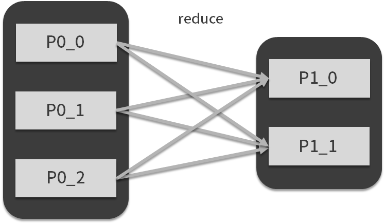
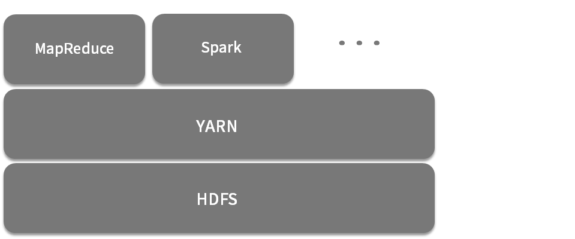
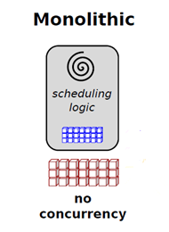
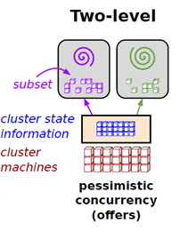
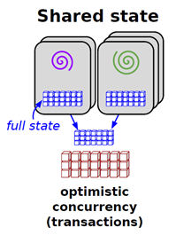
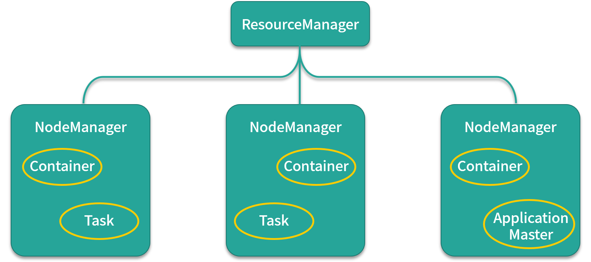

# 01MapReduce：计算框架和编程模型

MapReduce 是其实现的一个分布式计算框架，其编程模型名为 MapReduce（拿编程模型的名字直接作为计算框架的名字）。

MapReduce 模型将数据处理方式抽象为 map 和 reduce，其中 map 也叫映射，顾名思义，它表现的是数据的一对一映射，通常完成数据转换的工作，如下图所示：

reduce 被称为归约，它表示另外一种映射方式，通常完成聚合的工作，如下图所示：

圆角框可以看成是一个集合，里面的方框可以看成某条要处理的数据，箭头表示映射的方式和要执行的自定义函数，运用 MapReduce 编程思想，我们可以实现以下内容：

- 将数据集（输入数据）抽象成集合；
- 将数据处理过程用 map 与 reduce 进行表示；
- 在自定义函数中实现自己的逻辑。

这样就可以实现从输入数据到结果数据的处理流程（映射）了。

> MapReduce 认为，再复杂的数据处理流程也无非是这两种映射方式的组合，例如 map + map + reduce，或者 reduce 后面接 map，等等

----

**如何理解分布式计算框架的编程接口与背后的工程实现**

当整个数据集的容量和计算量达到 1 台计算机能处理的极限的时候，我们就会想办法把图中方框所代表的数据集分别交给不同的计算机来完成，那么如何调度计算机，如何实现 reduce 过程中不同计算机之间的数据传输等问题，就是 Spark 基于 MapReduce 编程模型的分布式实现，这也是我们常常所说的分布式计算。

我们可以这样理解基于 MapReduce 编程模型的分布式计算框架，其编程接口与普通函数式语言的数据处理并没有什么不同（甚至可以说完全一样），但是背后的工程实现千差万别，而像 Spark、MapReduce 这样的框架，它们的目标都是尽力为用户提供尽可能简单的编程接口以及高效地工程实践。从这个角度上来讲，我们可以把 Spark 看成是一种分布式计算编程语言，它的终极目标是希望达到这样一种体验：**让用户处理海量数据集时与处理内存中的集合变量并没有什么不同**。

# 02Hadoop：集群的操作系统

----

**Hadoop1.0**

Hadoop 1.0 的架构也比较简单，基本就是按照论文中的框架实现，其架构如下图所示：

其中，**下层是 GFS 的开源实现 HDFS（Hadoop 分布式文件系统），上层则是分布式计算框架 MapReduce**，这样一来，分布式计算框架基于分布式文件系统，看似非常合理。但是，在使用的过程中，这个架构还是会出现不少问题，主要有 3 点：

- 主节点可靠性差，没有热备
- 提交 MapReduce 作业过多的情况下，调度将成为整个分布式计算的瓶颈
- 资源利用率低，并且不能支持其他类型的分布式计算框架。

第 1 点是小问题，涉及到对系统可用性方面的改造，但是第 2 点与第 3 点提到的问题就比较犀利了。

第 2 个问题在于，Hadoop 1.0 的分布式计算框架 MapReduce 并**没有将资源管理和作业调度这两个组件分开**，造成当同时有多个作业提交的时候，资源调度器会不堪重负，导致资源利用率过低；

第 3 个问题则是**不支持异构的计算框架**，这是什么意思呢？其实当时 Spark 已经问世了，但是如果这个集群部署了 Hadoop 1.0，那么想要运行 Spark 作业就必须另外再部署一个集群，这样无疑是对资源的浪费，很不合理

-----

Hadoop 2.0

基于这些问题，社区开始着手 Hadoop 2.0 的开发，Hadoop 2.0 最大的改动就是引入了**资源管理与调度系统 YARN**，代替了原有的计算框架，而计算框架则变成了类似于 YARN 的用户，如下图：

YARN 将集群内的所有计算资源抽象成一个资源池，资源池的维度有两个：**CPU 和内存**。

同样是基于 HDFS，我们可以认为 YARN 管理计算资源，HDFS 管理存储资源。上层的计算框架地位也大大降低，变成了 YARN 的一个用户，另外，YARN 采取了双层调度的设计，大大减轻了调度器的负担。

Hadoop 2.0 基本上改进了 Hadoop 的重大缺陷，此外 YARN 可以兼容多个计算框架，如 Spark、Storm、MapReduce 等，HDFS 也变成了很多系统底层存储，Hadoop 以一种兼收并蓄的态度网罗了一大批大数据开源技术组件，逐渐形成了一个庞大的生态圈，如下图所示（该图只展示了一部分组件）。在当时，如果你要想搭建一个大数据平台，绝对无法绕过 Hadoop。

-------

Hadoop 生态圈与发行版

Hadoop 生态圈的各个组件包含了 Hadoop 的核心组件，如 HDFS、YARN。在计算层也有了更多的选择，如支持 SQL 的 Hive、Impala，以及 Pig、Spark、Storm 等。还有些工具类的组件，比如负责批量数据抽取的 Sqoop，负责流式数据传输的 Flume，负责分布式一致性的 Zookeeper。此外，还有一些运维类组件，例如负责部署的 Ambari、集群监控的 ganglia 等。这些组件看似繁杂，但都是一个生产环境的所必需的。所以在当时，将如此多的组件集成到一个平台，会有很多各式各样的问题。

将上述 Hadoop 生态圈中最常用到的开源组件打包为一个 Hadoop 发行版，**Clouera 的叫 CDH**，Hortonworks 的叫 HDP，这个发行版中的所有组件不会有兼容性等其他莫名其妙的问题。

--------

**Hadoop 大数据平台**

学习大数据的时候，你可能习惯把 Hadoop 与原有的应用开发那一套进行类比，但会发现没办法完全对应上，例如Hadoop确实能够用来存储数据，那么Hadoop就是数据库了吗？而很多文章在提到Hadoop的时候，有时会用大数据平台、数据仓库、分布式数据库、分布式计算框架等字眼，看似合理，但又不完全正确，让人非常迷惑。

这里，我对 Hadoop 做一个简单的解释。*举例来说，在做传统应用开发的时候，我们不会过多的关注磁盘驱动器，这是因为文件系统已经帮我们进行了抽象，我们只需要使用文件系统 API 就可以操作磁盘驱动器。同样的，我们在开发应用时也无需关注 CPU 的使用时间，操作系统和编程语言已经帮我们做好了抽象和隔离*。

所以在提到大数据平台的时候，我们要知道它首先是一个**分布式系统**，换言之底层是**由一组计算机构成的**，也就是一个集群**。所谓大数据平台，相当于把这个集群抽象成一台计算机，而隔离了底层的细节，让用户使用这个平台时，不会感觉到自己在使用一个分布式系统，而像是在使用一台计算机，很轻松地就可以让整个集群为他所用**。为了加深印象，我们可以来对比下两条命令：

`hadoop dfs -ls /`;`ls /`

第一条命令是浏览 Hadoop 文件系统（HDFS）的根目录，第二条命令是浏览 Linux 本地文件系统的根目录，如果不进行说明的话，无法看出第一条命令基于分布式文件系统，此外，这么对比的话，可以看到基于集群，Hadoop 为用户提供了一套类似 Liunx 的环境。

因此，**Hadoop 可以理解为是一个计算机集群的操作系统，而 Spark、MapReduce 只是这个操作系统支持的编程语言而已，HDFS 是基于所有计算机文件系统之上的文件系统抽象。同理，YARN 是基于所有计算机资源管理与调度系统之上的资源管理与调度系统抽象，Hadoop 是基于所有计算机的操作系统之上的操作系统抽象。所以如果你一定要进行比较的话，Hadoop 应该和操作系统相比较。**

---

# 03如何设计与实现统一资源管理与调度系统

Hadoop 2.0 与 Hadoop 1.0 最大的变化就是引入了 YARN，而 Spark 在很多情况下，往往也是基于 YARN 运行，所以，相比于分布式文件系统 HDFS，YARN 是一个比较关键的组件，承担着计算资源管理与调度的工作

---

**统一资源管理与调度系统的设计**

YARN 的全称是 Yet Another Resource Negotiator，直译过来是：**另一种资源协调者**，但是它的标准名称是**统一资源管理与调度系统**，这个名称比较抽象，当遇到这种抽象的名词时，我喜欢把概念拆开来看，那么这个名称一共包含 3 个词：统一、资源管理、调度。

1. 统一

   对于大数据计算框架来说，统一指的是**资源并不会与计算框架绑定，对于所有计算框架来说，所有资源都是无差别的**，也就是说这个系统可以支持多种计算框架，但这是狭义的统一，我们理解到这里就可以了。而广义上的统一，是指资源针对所有应用来说都是无差别的，包括长应用、短应用、数据库、后端服务，等等。

2. 资源管理

   对于资源管理来说，最重要的是了解对于这个系统，什么才是它的资源，或者说是资源的维度，常见的有 CPU、内存、磁盘、网络带宽等，对于 YARN 来说，资源的维度有两个：**CPU 和内存**。这也是大数据计算框架最需要的资源。

3. 最后一个词语：调度

   说到调度，就没那么简单了。目前的宏观调度机制一共有 3 种：**集中式调度器（Monolithic Scheduler）、双层调度器（Two-Level Scheduler）和状态共享调度器（Shared-State Scheduler）**

> - 集中式调度器（Monolithic Scheduler）:
>
> 集中式调度器全局只有一个中央调度器，计算框架的资源申请全部提交给中央调度器来满足，所有的调度逻辑都由中央调度器来实现。所以调度系统在高并发作业的情况下，容易出现**性能瓶颈**，如下图所示，红色的方块是集群资源信息，调度器拥有全部的集群资源信息（蓝色方块），集中式调度器的实现就是 Hadoop MapReduce 的 JobTracker，实际的资源利用率只有 70% 左右，甚至更低。Jobtracker 有多不受欢迎呢，从 Hadoop 2.0 中 YARN 的名字就可以看出：另一种资源协调器，你细品。这种在多个计算作业同时申请资源的时候，中央调度器实际上是没有并发的，完全是顺序执行。
>
> 
>
> - 双层调度器（Two-Level Scheduler）
>
> 顾名思义，双层调度器将整个调度工作划分为两层：**中央调度器和框架调度器**。中央调度器管理集群中所有资源的状态，它拥有集群所有的资源信息，按照一定策略（例如 FIFO、Fair、Capacity、Dominant Resource Fair）将资源粗粒度地分配给框架调度器，各个框架调度器收到资源后再根据应用申请细粒度将资源分配给容器执行具体的计算任务。在这种双层架构中，每个框架调度器看不到整个集群的资源，只能看到中央调度器给自己的资源，如图所示：
>
> 
>
> - 状态共享调度器
>
> 状态共享调度器是由 Google 的 Omega 调度系统所提出的一种新范型，与谷歌的其他论文不同，Omega 这篇论文对详细设计语焉不详，只简单说了下大体原理和与其他调度范型的比较。
>
> 状态共享式调度大大弱化了中央调度器，它**只需保存一份集群使用信息**，就是图中间的蓝色方块，取而代之的是各个框架调度器，每个调度器都能获取集群的全部信息，并采用乐观锁控制并发。Omega 与双层调度器的不同在于严重弱化了中央调度器，每个框架内部会不断地从主调度器更新集群信息并保存一份，而框架对资源的申请则会在该份信息上进行，一旦框架做出决策，就会将该信息同步到主调度。资源竞争过程是通过事务进行的，从而保证了操作的原子性。由于决策是在自己的私有数据上做出的，并通过原子事务提交，系统保证只有一个胜出者，这是一种类似于 MVCC 的乐观并发机制，可以增加系统的整体并发性能，但是调度公平性有所不足。对于这种调度范式你可以不用深究，这里介绍主要是为了知识的完整性。
>
> 

--------

**统一资源管理与调度系统的实现：YARN**

前面一直在务虚，现在让我们来务实一下。YARN 是 Hadoop 2.0 引入的统一资源管理和调度系统，也很具有代表性，目前 Spark on YARN 这种模式也在大量使用，所以接下来，我们来讨论下 YARN。

简单来看看 YARN 的架构图，YARN 的架构是典型的主从架构，主节点是 ResourceManger，也是我们前面说的主调度器，所有的资源的空闲和使用情况都由 ResourceManager 管理。ResourceManager 也负责监控任务的执行，从节点是 NodeManager，主要负责管理 Container 生命周期，监控资源使用情况等 ，Container 是 YARN 的资源表示模型，Task 是计算框架的计算任务，会运行在 Container 中，ApplicationMaster 可以暂时认为是二级调度器，比较特殊的是它同样运行在 Container 中。

我们来看看 YARN 启动一个 MapReduce 作业的流程，如图所示：

- 第 1 步：客户端向 ResourceManager 提交自己的应用，这里的应用就是指 MapReduce 作业。

- 第 2 步：ResourceManager 向 NodeManager 发出指令，为该应用启动第一个 Container，并在其中启动 ApplicationMaster。

- 第 3 步：ApplicationMaster 向 ResourceManager 注册。

- 第 4 步：ApplicationMaster 采用轮询的方式向 ResourceManager 的 YARN Scheduler 申领资源。

- 第 5 步：当 ApplicationMaster 申领到资源后（其实是获取到了空闲节点的信息），便会与对应 NodeManager 通信，请求启动计算任务。

- 第 6 步：NodeManager 会根据资源量大小、所需的运行环境，在 Container 中启动任务。

- 第 7 步：各个任务向 ApplicationMaster 汇报自己的状态和进度，以便让 ApplicationMaster 掌握各个任务的执行情况。

- 第 8 步：应用程序运行完成后，ApplicationMaster 向 ResourceManager 注销并关闭自己。

ApplicationMaster 与前面讲的框架调度器（二级调度器）很像，可以看看前面那种双层调度的范式图：

首先可以看到最下面的一个单词是 offers，还有蓝色和绿色的箭头方向，这说明什么问题呢？主调度器拥有整个集群资源的的状态，通过 Offer（**主动提供**，而不是被动请求）方式通知每个二级调度器有哪些可用的资源。每个二级调度器根据自己的需求决定是否占有提供的资源，决定占有后，该分区内的资源由二级调度器全权负责。

这句话怎么理解呢？如果你将集群资源看成一个整体，那么这种方式可以认为是**预先将整个资源进行动态分区**。**作业则向二级调度器申请资源，可以多个作业共用一个二级调度器，此外，每个二级调度器和主调器都可以配置不同的调度算法模块**。

那么从这个点上来说，YARN 离真正的双层调度还有些差距，但和前面讲的 JobTracker 相比，已经是很大的进步了，并显著提升了调度性能，某度程度上，**也可以说是一种双层调度，或者更准确地说，两次调度**。

由于 Spark 与 MapReduce 相比，是一种 DAG 计算框架，包含一系列的计算任务，比较特殊，所以 **Spark 自己实现了一个集中式调度器  Driver，用来调用作业内部的计算任务**。申请到的资源可以看成是申请分区资源，在该分区内，所有资源由 Driver 全权使用，以客户端方式提交的 Spark on Yarn 这种方式可以看成是 Driver 首先在资源管理和调度系统中注册为框架调度器（二级调度器），接收到需要得资源后，再开始进行作业调度。那么这种方式可以认为**是一种曲线救国的双层调度实现方式**

# 04解析 Spark 数据处理与分析场景